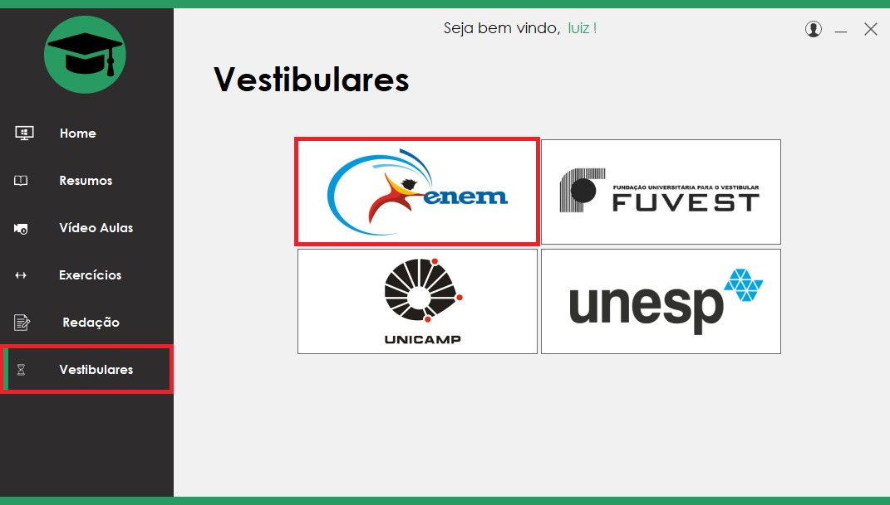

# Classroom - Software de Estudos

Projeto para conclusão do curso técnico de informática da ETEC Lauro Gomes. Foi desenvolvido na linguagem de programação C# e possui conexão ao banco de dados externo por meio do SQLServer. O projeto consiste em um software de estudos, apresentando resumos, videoaulas, exercícios e informações dos maiores vestibulares do país. 

## Funcionalidade

Logo que iniciado o software solicita ao usuário a criação de uma conta para acessar as funcionalidades:

O usuário após se cadastrar no banco de dados, é encaminhado para a tela de login onde deve se autenticar.

**Usuário** - O sistema permite personalização do usuário, podendo mudar o nome e foto, além de outros dados cadastrais. O mesmo pode também soliciar a remoção de sua conta do banco de dados, há também a possibilidade de solicitar uma mudança de senha por e-mail, caso o usuário a esqueça. Além disso, o mesmo pode ver seu desempenho em simulados.

O sistema possui o essencial para o aluno que deseja estudar como resumos, videoaulas, exercicios e informações sobre os principais vestibulares do país. Além de dicas para melhorar a produtividade no estudo.

**Resumos** - O usuário pode escolher uma matéria para ver os resumos, como "Matemática, e a partir dai é encaminhado para uma tela de escolha do conteúdo como "Porcentagem , "Logaritmos" e afins. Esse modelo segue o mesmo padrão para outras matérias, sendo todos esses resumos produzidos pela equipe de alunos.

**Vídeo Aula** - Segue o mesmo padrão da funcionalidade anterior, entretanto agora encaminha-se para um vídeo do youtube relacionado ao tema escolhido, a escolha de vídeo aulas foi feita pela equipe de alunos. 

**Simulados** - Nessa tela o usuário escolhe uma matéria geral e poderá fazer um teste de 10 questões selecionadas dos maiores vestibulares do país. É exibido ao final do teste o número de acertos, além de cadastrar no banco de dados essa informação para o estudante observar seu progresso.

**Redação** - Nessa opção é exibido ao usuário algumas dicas para uma melhor redação, além de permitir que o mesmo veja os últimos temas, possíveis temas e modo de avaliação para as redações do ENEM, Fuvest, Unicamp e Unesp.

**Vestibulares** - Essa tela exibe ao usuário informações gerais sobre os maiores vestibulares, além de sua data de aplicação e site oficial.

## Execução

A execução da aplicação é feita na IDE da Microsoft, o Visual Studio. 

## Integrantes

O software em questão foi desenvolvido por um grupo de 4 pessoas.

Beatriz Villas Boas - https://www.linkedin.com/in/beatriz-vilas-boas-020209171/

Luiz Otavio - https://www.linkedin.com/in/luiz-ot%C3%A1vio-prado-9a743b162/

Antonio Muniz - https://www.linkedin.com/in/antuniooh/

Lais Julia - 

